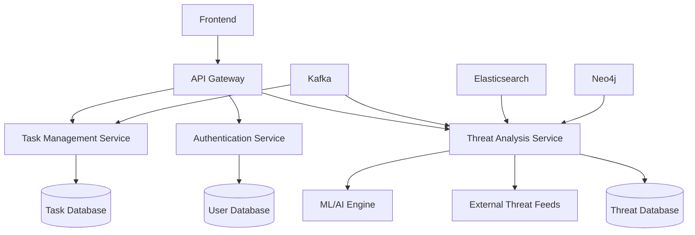

# CTAS System Architecture

The Complex Threat Analysis System (CTAS) is built on a modular, scalable architecture designed to handle complex cybersecurity operations efficiently. This document provides an overview of the system's architecture and how its components interact.

## High-Level Architecture

## Components

1. **Frontend**: React-based user interface
2. **API Gateway**: Manages and routes incoming requests
3. **Authentication Service**: Handles user authentication and authorization
4. **Threat Analysis Service**: Core service for threat detection and analysis
5. **Task Management Service**: Manages and tracks operational tasks
6. **User Database**: Stores user information and preferences
7. **Threat Database**: Stores threat intelligence data
8. **Task Database**: Stores task-related information
9. **External Threat Feeds**: Integrates with external threat intelligence sources
10. **ML/AI Engine**: Provides machine learning and AI capabilities for advanced analysis
11. **Kafka**: Facilitates real-time data streaming between services
12. **Elasticsearch**: Enables fast, full-text search capabilities
13. **Neo4j**: Graph database for storing and analyzing complex relationships

## Data Flow

1. User requests are received by the Frontend and sent to the API Gateway.
2. The API Gateway authenticates the request using the Authentication Service.
3. Authenticated requests are routed to the appropriate service (Threat Analysis or Task Management).
4. The Threat Analysis Service processes threat data, integrating information from external feeds and the ML/AI Engine.
5. Real-time updates are streamed through Kafka to relevant services and the Frontend.
6. Complex queries and relationship analysis are performed using Neo4j.
7. Fast text-based searches are handled by Elasticsearch.

## Scalability and Resilience

- Each component is designed to be horizontally scalable.
- Services are containerized using Docker for easy deployment and scaling.
- Kubernetes is used for orchestration and automatic scaling based on load.
- Data replication and sharding are implemented for databases to ensure high availability and performance.

## Security Considerations

- All communication between components is encrypted using TLS.
- The Authentication Service implements OAuth2 and JWT for secure user authentication.
- Role-Based Access Control (RBAC) is used to manage user permissions across the system.
- Regular security audits and penetration testing are conducted to identify and address vulnerabilities.

This architecture provides CTAS with the flexibility, scalability, and security needed to handle complex cybersecurity operations effectively. As the system evolves, new components can be easily integrated into this modular structure.